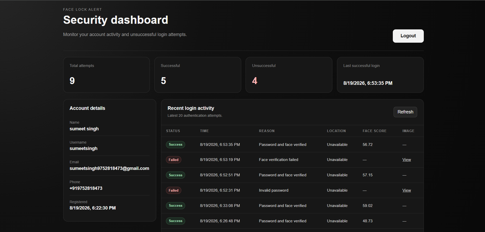
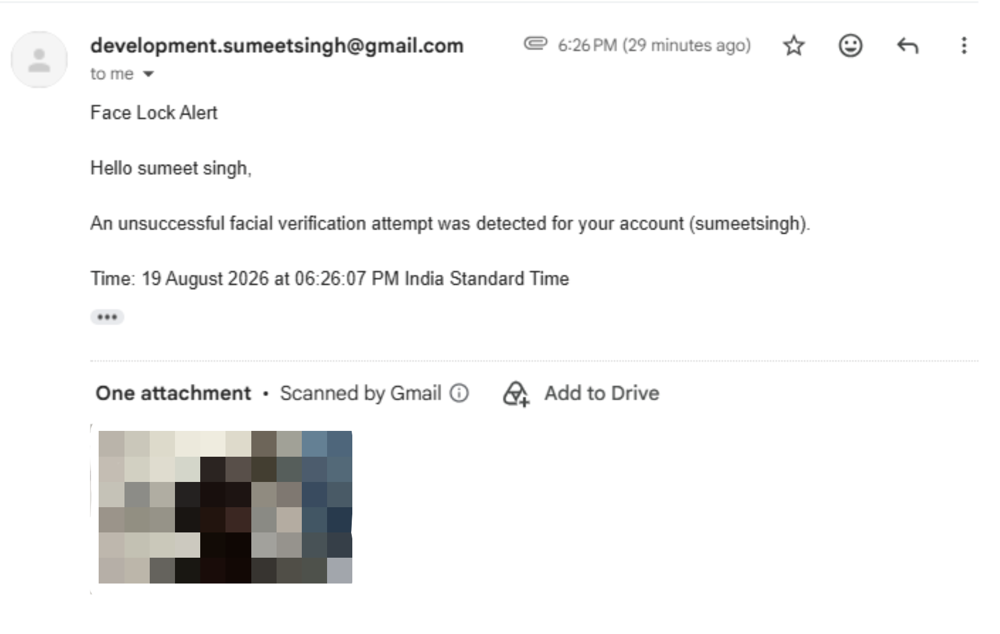
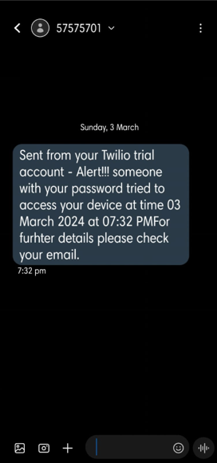

# Face Lock Alert System

A biometric authentication web application that combines password-based login with facial verification to detect unauthorized access attempts and notify the registered user.

## Features

- User registration with name, username, email, phone number, and password.
- Automatic capture of 15 facial samples during registration.
- OpenCV LBPH-based facial recognition for login verification.
- MySQL persistence for user data, face samples, trained face models, and authentication logs.
- Automatic face capture during login after the user submits credentials.
- Geolocation capture for authentication attempts when browser permission is granted.
- Email and SMS alerts for unsuccessful authentication attempts.
- Dashboard with login statistics, account details, authentication history, timestamps, locations, confidence scores, and captured threat images.
- Password hashing using Werkzeug security utilities.
- React + Vite frontend with Flask REST API backend.

## Technology Stack

**Frontend:** React, Vite, JavaScript, HTML/CSS

**Backend:** Python, Flask, Flask-CORS, OpenCV, LBPH Face Recognizer, Werkzeug, Python Dotenv

**Database:** MySQL, MySQL Connector/Python

**Notifications:** SMTP email, Twilio SMS

## Application Workflow

### Registration

1. User submits account information.
2. Backend creates the user record in MySQL with a hashed password.
3. Browser automatically captures 15 facial samples.
4. Face samples are processed and stored in MySQL.
5. An LBPH model is trained for the registered user.
6. Registration is completed and the user can log in.

### Login

1. User enters username and password.
2. Clicking **Login** automatically captures a face image.
3. Browser location is requested when available.
4. Backend validates the username and password.
5. The captured face is compared with the user's registered LBPH model.
6. A successful match creates a successful login record and opens the dashboard.
7. A failed password or face verification creates an unsuccessful login record and triggers email/SMS security alerts with available time and location details.

## API Endpoints

| Method | Endpoint | Purpose |
|---|---|---|
| GET | `/api/health` | Backend health check |
| GET | `/api/config` | Returns face capture configuration |
| POST | `/api/auth/register` | Creates a user account |
| POST | `/api/auth/register-face` | Stores face samples and trains the user model |
| POST | `/api/auth/login` | Authenticates password and face together |
| GET | `/api/me` | Returns the authenticated user |
| GET | `/api/dashboard` | Returns login statistics and recent attempts |
| GET | `/api/dashboard/attempts/<id>/image` | Returns a captured unsuccessful-login image |
| POST | `/api/auth/logout` | Ends the authenticated session |

## Dashboard



The dashboard provides account information, authentication statistics, recent activity, timestamps, geolocation data, face confidence scores, and captured images from unsuccessful attempts.

## Security Alerts

<table>
<tr>
<td width="75%" align="center"><strong>Threat Alert Email</strong></td>
<td width="25%" align="center"><strong>Threat Alert SMS</strong></td>
</tr>
<tr>
<td width="75%" valign="top"></td>
<td width="25%" valign="top"></td>
</tr>
</table>

## Project Structure

```text
face-lock-alert-system/
├── backend/
│   ├── app.py
│   ├── alerts.py
│   ├── db.py
│   ├── face_service.py
│   ├── requirements.txt
│   └── .env.example
├── frontend/
│   ├── src/
│   │   ├── App.jsx
│   │   ├── main.jsx
│   │   └── styles.css
│   ├── package.json
│   ├── vite.config.js
│   └── index.html
├── screenshots/
│   ├── dashboard.png
│   ├── threat-alert-email.png
│   └── threat-alert-sms.png
└── README.md
```

## Configuration

Create `backend/.env` from `backend/.env.example` and configure the MySQL credentials, Flask secret, email sender credentials, and Twilio credentials.

Gmail SMTP requires a Google App Password rather than the normal Gmail account password.

Never commit `backend/.env` or expose its credentials publicly.

## Local Setup

### Backend

```bash
cd backend
pip install -r requirements.txt
python app.py
```

The Flask API runs on port `5000`.

### Frontend

```bash
cd frontend
npm install
npm run dev
```

The Vite development server runs on port `5173`.

## Deployment

The React frontend can be deployed as a free static site and the Flask backend as a free web service on platforms such as Render. The application requires a publicly accessible MySQL database; Aiven provides a free MySQL tier suitable for small projects and demonstrations.

For production deployment, configure backend environment variables on the hosting platform rather than committing credentials to the repository.

Free hosting services can have sleep, resource, and usage limitations. SMS delivery through Twilio is a separate third-party service and may require paid usage or available trial credits.

## License

This project is available for educational and portfolio use.
